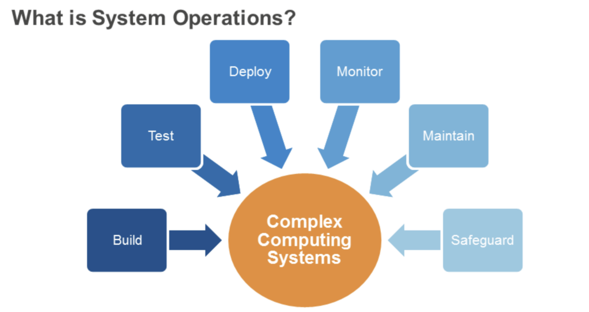

# AWS NOTES

## System Operations

System Operations includes, but is not limited to, the following areas: 
- Network configuration and management
- Server configuration and deployment
- Application deployment and management
- Storage, backup, and archive
- Monitoring
- Security (AWS)

