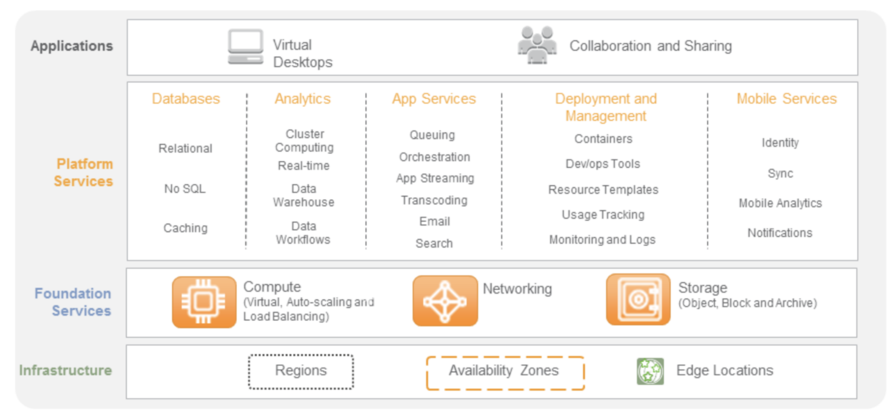
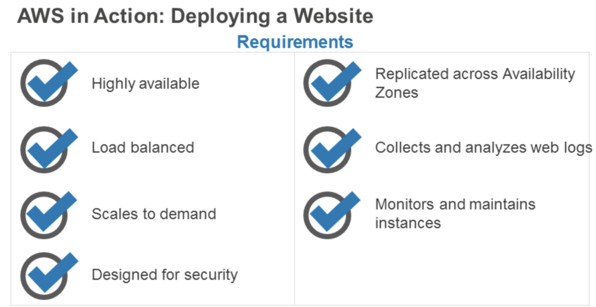
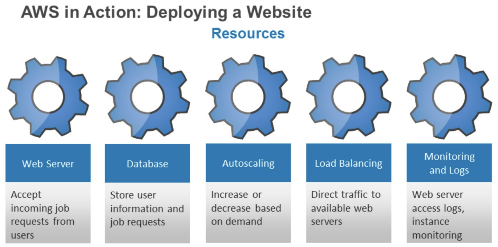
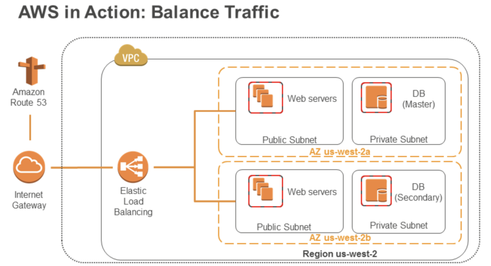
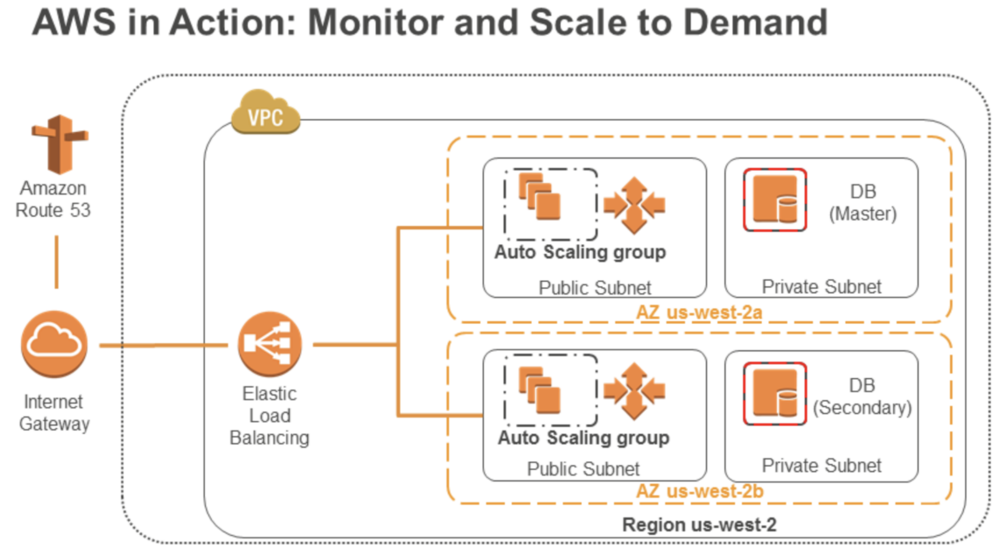
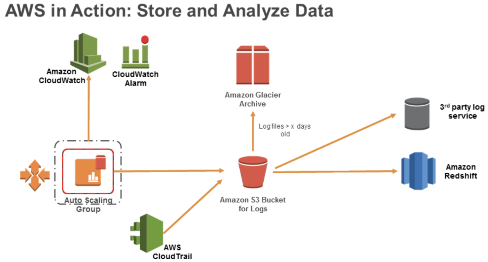
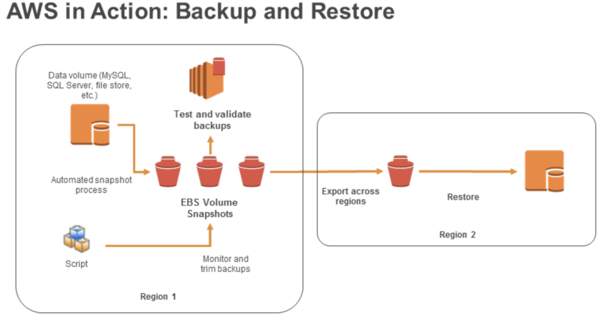
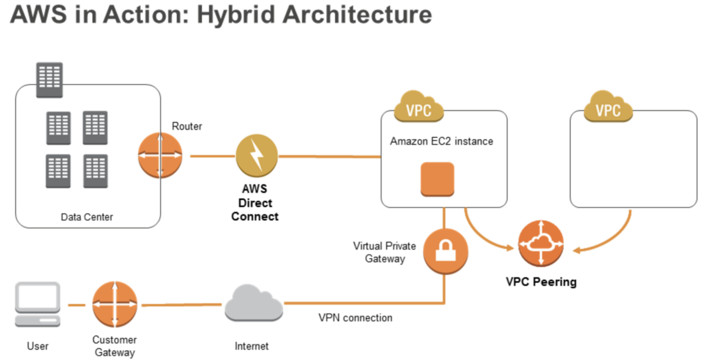
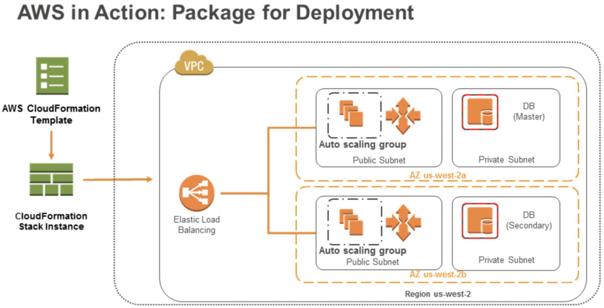

## AWS Service Stack

## AWS Region, AZs and Edge Locations
- Partition: China, USA Government and international
- Region: is a collection of two or more Availability Zones in a specific geographic area. (AWS)
- AZ: An Availability Zone (AZ) is an isolated collection of AWS resources.  (AWS)

## Service Stack

## Action in AWS

